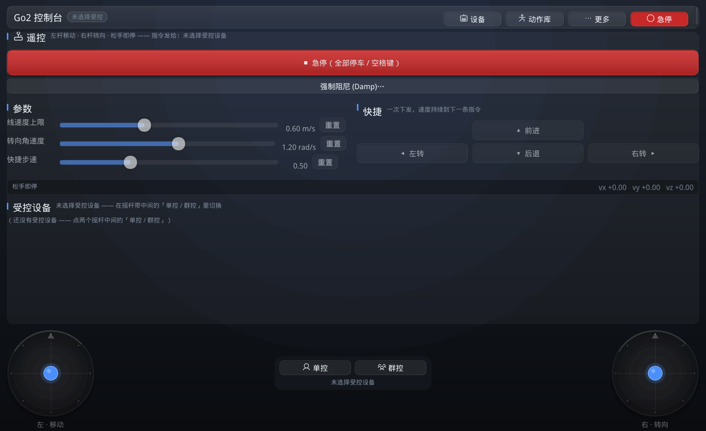
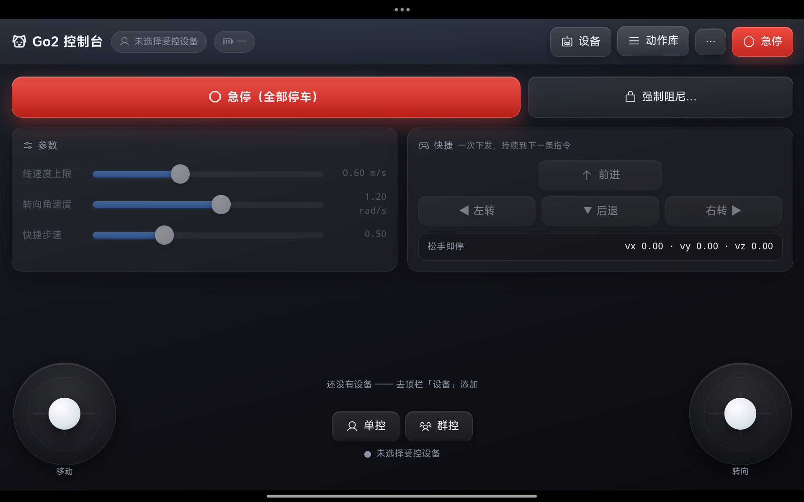
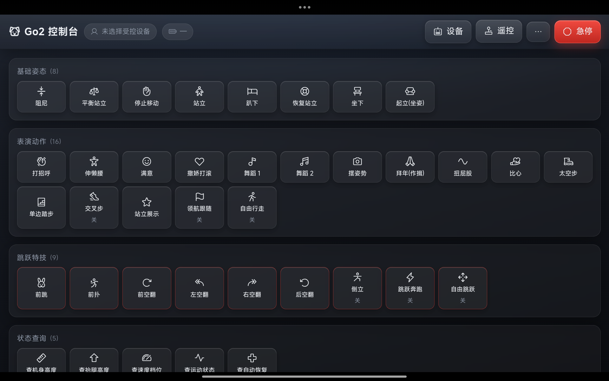

# 🐕 Go2ProController · Unitree Go2 控制与网络诊断工具集

<p align="center">
  <strong>面向 Unitree Go2 系列机器狗的多机遥控、动作控制与网络诊断工具集</strong>
</p>

<p align="center">
  <a href="https://github.com/illuvorite/Go2ProController">
    
  </a>
  <a href="https://vuejs.org/">
    
  </a>
  <a href="https://github.com/illuvorite/Go2ProController">
    
  </a>
  <a href="https://github.com/illuvorite/Go2ProController">
    
  </a>
  <a href="./LICENSE">
    
  </a>
</p>

> Go2ProController 通过机器狗 WiFi / 网口上的 **WebRTC 数据通道**，集中完成设备发现、多机连接、
> 单控/群控遥控、动作库下发与急停安全控制；配套 Python 诊断 CLI 完成 WebRTC 控制链路体检与
> DDS/抓包分析。桌面（WSL2）、安卓（APK）、任意浏览器三端同一套界面。

## 目录

- [项目简介](#项目简介)
- [功能总览](#功能总览)
- [界面演示](#界面演示)
- [运行环境](#运行环境)
- [快速开始](#快速开始)
- [典型使用流程](#典型使用流程)
- [开发与构建](#开发与构建)
- [打包与发布](#打包与发布)
- [项目结构](#项目结构)
- [配置项说明](#配置项说明)
- [常见问题（FAQ）](#常见问题faq)
- [相关文档](#相关文档)
- [问题反馈](#问题反馈)
- [许可证](#许可证)

## 项目简介

本项目把 **WebRTC 控制通道** 与 **网络层诊断** 两条路都打通，并沉淀了完整实测结论
（信令端口 9991/8081、`data2=1/2/3` 三种加密模式、动作回执码、持续模式语义等）。

当前主要面向以下场景：

- 多台 Go2（Air / Pro 混合）的局域网自动发现、批量连接与长期保活；
- 单控 / 群控遥控：双摇杆 + 快捷方向 + 急停安全链；
- 动作库下发（normal / MCF 双指令集自动匹配）与开关型"持续模式"管理；
- `data2=3` 新固件的每设备 AES 钥匙管理（含不连电脑的机内提取）；
- 连不上 / 连上掉线 / 指令被拒时的网络层与链路层诊断。

本项目是**控制端工具与诊断工具**，不包含机器人端固件修改，也不依赖宇树官方 SDK；
所有控制指令通过机器狗已有的 WebRTC 信令与数据通道下发。

## 功能总览

### 🔌 设备发现与多机管理

- 局域网自动发现：本机所有网段并发扫描（探测 9991/8081 信令端口）+ **UDP 多播按 SN 发现**（`231.1.1.1:10131`）
- 手动添加（支持一次粘贴多个 IP，逗号/分号/空格分隔）
- 多设备勾选受控：**勾 1 台 = 单控，勾多台 = 群控**，所有动作 / 遥控 / 急停按勾选分发
- 每台狗可改名（持久化 `robot_names.json`）、显示电量 / 运动模式 / 连接状态
- 错峰连接（狗的信令服务是单线程 accept）、掉线自动重连（指数退避，上限 30s）、
  链路统计（RTT / 收包 / 心跳 / 在线时长 / 重连次数）

### 🎮 遥控与安全

- **双摇杆**：左杆全向平移、右杆转向；10Hz 持续下发，**松手即停**（急停语义有单元测试）
- 速度上限 / 转向角速度可调；快捷方向按钮（前进 / 后退 / 左转 / 右转）
- **急停（锁定式）**：停速度 + **逐个关闭全部"持续模式"开关**（自由行走 / 领航跟随 / 交叉步 …），
  锁定期间摇杆与快捷步一律不下发；`空格键` 随时触发
- **强制阻尼（Damp）**：兜底手段（狗会软腿趴下），二次确认
- 断开连接前自动停车

### 📋 动作库

- 宇树动作库 50+ 条指令，按 5 组分类（基础姿态 / 表演动作 / 跳跃特技 / 状态查询 / 其他·进阶）
- **normal 与 MCF 双指令集**自动匹配：发错指令集被拒时**自动换另一套 api_id 重试一次**
- 参数类型自适应（无参 / 开关 `{"data":bool}` / 整数 / 浮点 / 姿态角 / 自定义 JSON）
- **可用性标注**：每条动作显示上次回执结果（✓/✗，悬停看失败原因）；可过滤固件不支持的动作
- 开关型指令（自由行走 / 经典步态 / 倒立 / 跳跃奔跑 …）画成开关，急停时自动全部关闭

### 🌐 网页界面（Vue3，三端同一套）

- **只换界面、不碰协议**：协议 / 加密 / 钥匙库全在 C++（`ui/web_bridge.{hpp,cpp}`），
  前端只做 `GET /api/state` + `POST /api/command`（详见 [`client/assets/web/README.md`](client/assets/web/README.md)）
- 深色玻璃风：渐变背景 / 毛玻璃卡片 / 苹果风滑条 / 悬浮摇杆 / 过渡动效
- 摇杆带中间是**受控狗卡片行**（Go2 实拍图 + 名字 + 电量 + 勾选框，多台横向滑动）——
  勾一台控一台、勾多台即群控；单控 / 群控按钮一键切换
- 桌面端启动即内建本机服务（默认 `http://localhost:8123`）；安卓端 app 自动打开内嵌 WebView；
  纯预览可用 `tools/web_preview.py`（假数据，不连狗）

### 🔑 钥匙管理（`data2=3` 新固件）

- 钥匙来源三级：`GO2_KEYS_FILE` / `GO2_AES_KEYS` 环境变量 → 用户目录 `keys.json` → 运行时缓存
- **从机器狗找钥匙**（不连电脑）：设置页一键扫描狗的内网端口、从 Web 服务抓取 32 位 hex 候选，
  一键采用（写入 keys.txt 并绑定 IP）
- 界面与日志只显示钥匙**数量**，从不显示内容；文件路径默认隐藏

### 🧪 网络诊断 CLI（`go2_network_diag/` + `main.py`）

- **连通性**：ICMP Ping、TCP/UDP 端口扫描、路由表与网卡信息
- **抓包分析**：实时抓包、RTPS/DDS 子消息解析与统计、双向流量对比
- **WebRTC 控制链路体检**（`webrtc` 子命令，多机排查首选）：双信令端口探测、`con_notify`
  握手与 `data2` 判定、SN 多播发现、逐台给出结论与建议
- **CycloneDDS 配置**：校验现有配置 / 按网卡与对端自动生成
- **报告**：HTML（美观）/ JSON（程序处理）/ TXT（简洁）

## 界面演示

### 桌面端（ImGui 原生界面，遥控页）

顶栏 4 键（设备 / 动作库 / 更多 / 急停）、急停 + 强制阻尼、苹果风滑条参数、快捷 D-pad、
双摇杆与中间的单控 / 群控面板。

<p align="center">
  
</p>

### 网页界面（平板 WebView 实拍，遥控页）

与桌面同一套 Vue3 前端：受控狗卡片勾选、单控 / 群控、急停 + 强制阻尼同行。

<p align="center">
  
</p>

### 网页界面（动作库页）

分组瓷砖网格 + Phosphor 图标，危险动作红框标注，开关型指令带 开/关 标记。

<p align="center">
  
</p>

## 运行环境

### 桌面控制台（ImGui 原生界面 + 网页界面）

| 项目 | 要求 |
| --- | --- |
| 系统 | **Ubuntu 22.04 / WSL2**（实机验证于 WSL2 + WSLg；macOS / Windows 原生代码就绪但未经实机验证） |
| 编译器 | g++ / clang++（**C++17**） |
| 构建 | CMake ≥ 3.16、Ninja（或 make） |
| 依赖库 | OpenSSL、OpenGL、GLFW（系统包）；libdatachannel / Dear ImGui / nlohmann-json / cpp-httplib 构建时自动获取 |
| 网络 | 与机器狗同网段（WiFi 或网口直连 `192.168.123.x`） |
| 显示 | Linux 桌面或 WSLg（仅 ImGui 界面需要；网页界面用浏览器即可） |

### 安卓端

| 项目 | 要求 |
| --- | --- |
| 系统 | Android 8.0（API 26）以上 |
| 构建 | Android Studio（NDK 26.x）+ 预编译 arm64 依赖（见 [`client/apps/android/README.md`](client/apps/android/README.md)） |
| 网络 | 与机器狗同一 WiFi（组播发现需要 MulticastLock，已内置） |

### 诊断工具

| 项目 | 要求 |
| --- | --- |
| Python | ≥ 3.8（推荐 3.10+） |
| 依赖 | 见 [`requirements.txt`](requirements.txt)（scapy / pyshark / rich / pandas …） |
| 权限 | 抓包与分析需要 `sudo`（或具备 `CAP_NET_RAW`） |

### 机器人端

- Unitree Go2（Air / Pro / EDU），固件 ≥ 1.1.11；
- 固件差异自动适配：`data2=3`（≥1.1.15，需每设备钥匙）/ `data2=2`（静态钥匙）/ 旧固件 8081 明文；
- 控制端与机器狗在同一局域网，且**同一时刻只允许一条 WebRTC 连接**（先退出手机官方 App）。

## 快速开始

### 1. 获取源码

```bash
git clone https://github.com/illuvorite/Go2ProController.git
cd Go2ProController
```

### 2. 构建控制台

```bash
cd client
cmake -S . -B build -G Ninja
cmake --build build -j
```

> 首次构建会自动获取并编译依赖（约 200MB，需要网络），并自动应用 Go2 兼容补丁
> （libdatachannel 不回 DCEP ACK 的修复）。产物：`client/build/go2_remote`（单文件，约 3MB）。

### 3. 启动

```bash
cd client
./build/go2_remote 192.168.123.161    # 启动并自动连接指定机器狗（可多个，错峰 600ms）
./build/go2_remote                    # 启动后手动扫描 / 输入 IP
```

启动后浏览器打开 `http://localhost:8123` 即可使用网页界面（ImGui 窗口与网页界面功能对应，可任选）。

### 4. 安卓端

构建与安装步骤见 [`client/apps/android/README.md`](client/apps/android/README.md)；
日常构建在 Windows 上执行 `client/apps/android/_run_gradle.bat`，然后
`adb install -r app/build/outputs/apk/debug/app-debug.apk`。
app 启动后自动进入网页界面；返回键回到 ImGui 界面。

### 5. 安装诊断工具

```bash
python3 -m venv .venv
.venv/bin/pip install -r requirements.txt
# 或安装为可调用命令： .venv/bin/pip install -e .
```

## 典型使用流程

```text
启动控制台（自动扫描局域网 / 手动添加 IP）
    ↓
连接机器狗（新固件需先完成钥匙配置，见 FAQ Q7）
    ↓
勾选受控对象（单控 / 群控）
    ↓
遥控（双摇杆 / 快捷方向）与动作库下发
    ↓
异常时急停（自动关持续模式）→ 必要时强制阻尼
    ↓
连不上 / 指令被拒 → 用诊断 CLI 做链路体检
```

### 安全提示

- **同一时刻只允许一条连接**：连接前先断开手机官方 App，否则机器人返回 `sdp: "reject"`；
- 同一台狗两次连接间隔 **≥ 15 秒**，连续重连触发 HTTP 429 限流；
- 刚就绪约 10 秒内是运动服务预热期，指令会被拒（客户端自动重试），手工操作等十几秒即可；
- 急停按一次即可，**不要连按**；一次性动作（舞蹈 / 空翻）执行期间无法打断，需要立即停住用「强制阻尼」；
- 钥匙文件（`keys.json` / `keys.txt` / `go2_keys_cache.json`）**一律不要提交到 Git**（`.gitignore` 已设防线）。

## 开发与构建

### 常用命令

```bash
# 构建控制台与自测
cd client
cmake -S . -B build -G Ninja
cmake --build build -j

# 自测（不需要机器狗）
./build/layout_test      # 断点布局编译期断言
./build/motion_test      # 双摇杆 + 急停决策自测
./build/crypto_test      # 加密/信令链路自测（用真实抓包数据）

# 无界面验证模式（需要机器狗）
./build/go2_remote --verify <ip> --seconds 60           # 连接稳定性报告
./build/go2_remote --verify <ip> --actions              # 动作回执校验
./build/go2_remote --verify <ip> --probe --seconds 80   # 动作可用性探测（只发安全指令）

# 网页界面预览（不连狗，Windows / Linux 均可）
python tools/web_preview.py            # → http://127.0.0.1:8123

# 安卓 APK（Windows）
client/apps/android/_run_gradle.bat
adb install -r client/apps/android/app/build/outputs/apk/debug/app-debug.apk
```

### 技术栈

| 组件 | 选型 | 用途 |
| --- | --- | --- |
| C++17 | — | 控制台主体（协议 / 加密 / 多机管理 / 双界面后端） |
| Dear ImGui + GLFW/SDL2 | — | 桌面与安卓原生界面 |
| Vue3（免构建） | `vue.esm-browser.prod.js` | 网页界面（importmap 直接引 vendor，无 npm 构建） |
| cpp-httplib | 单头文件 | 9991 信令 + 网页界面本机服务 |
| libdatachannel | FetchContent / 预编译 | WebRTC DataChannel |
| OpenSSL | 系统包 / 预编译 | AES-GCM、RSA、MD5、Base64 |
| nlohmann/json | 单头文件 / FetchContent | — |
| Python 3.8+ | scapy / pyshark / rich | 诊断 CLI |

### 代码分层

- `client/core/`：**纯逻辑层（禁止平台头）** —— 信令、单机 WebRTC 通道、多机管理、发现、
  加密、动作指令表、运动决策（纯函数）、钥匙加载、宇树云接口；
- `client/platform/net.hpp`：平台网络层唯一接缝（POSIX / Winsock），新增网络代码一律走这里；
- `client/ui/`：ImGui 界面层（layout 断点 / theme / icons）+ 网页界面后端（`web_bridge`）；
- `client/apps/`：桌面入口（`desktop/main.cpp`）与安卓入口（`android/native/main_android.cpp`）；
- `client/assets/web/`：Vue3 前端（安卓 `app/src/main/assets/web/` 为其打包副本，改前端要两处同步）；
- `go2_network_diag/` + `main.py`：Python 诊断 CLI；
- `tools/`：排查运维脚本与图标生成器（非运行时依赖）。

## 打包与发布

- **桌面**：CMake 构建产物为单文件 `client/build/go2_remote`；Windows 侧可用
  [`start_go2.bat`](start_go2.bat) 一键重置 WSLg 并启动；
- **安卓**：`client/apps/android/_run_gradle.bat` → `app/build/outputs/apk/debug/app-debug.apk`，
  覆盖安装（`adb install -r`）保留钥匙与设备命名；
- **网页界面**：随桌面可执行文件 / 安卓 APK 内置分发，无独立构建步骤；
  前端变更后桌面重编、安卓需同步 `assets/web` 副本（见 [`client/assets/web/README.md`](client/assets/web/README.md) 维护清单）；
- **诊断 CLI**：`pip install -e .` 提供 `go2-diag` 命令。

版本以 git 提交与 Tag 为准，无独立版本号文件；重大变更记录在各阶段提交信息中。

## 项目结构

```text
Go2ProController/
├── client/                          # ★ Go2 控制管理台
│   ├── CMakeLists.txt               #   构建：go2_core(静态库) + go2_remote(exe) + 自测目标
│   ├── core/                        #   ★ 纯逻辑层（禁止平台头，跨平台可复用）
│   ├── platform/net.hpp             #   平台网络层唯一接缝（POSIX / Winsock）
│   ├── ui/                          #   ImGui 界面 + 网页界面后端（web_bridge）+ 断点布局 + 主题
│   ├── apps/desktop/main.cpp        #   桌面入口（GUI / 无界面验证 / 内建网页服务）
│   ├── apps/android/                #   ★ 安卓端（SDL2 + GLES3 + WebView 网页界面）
│   ├── assets/                      #   fonts/Phosphor.ttf + web/（Vue3 前端）
│   ├── patches/apply_go2_fix.cmake  #   Go2 兼容补丁：DCEP ACK（构建时自动应用，幂等）
│   ├── tests/                       #   crypto / motion / layout / discovery / cloud 自测
│   └── README.md                    #   控制台详细说明
├── go2_network_diag/                # ★ Python 诊断包（cli / 抓包 / DDS 分析 / webrtc 体检 …）
├── docs/
│   ├── go2_webrtc_protocol.md       #   WebRTC 协议实测记录（信令 / SDP / 加密 / 指令格式）
│   ├── multi_go2_pro_solution.md    #   多机方案：原因分析 / 排查过程 / 钥匙路线 / 验证
│   └── usage.md                     #   历史存档：最初的需求文档（无线通讯异常排查）
├── examples/                        # 诊断工具示例配置（config.yaml / cyclonedds_wifi.xml）
├── scripts/                         # 部署辅助脚本（路由 / 防火墙 / 环境检查）
├── tools/                           # 排查运维脚本 + 图标生成器（见 tools/README.md）
├── main.py                          # 诊断工具入口
├── setup.py / requirements.txt      # Python 打包与依赖
├── run.sh                           # 诊断工具快速启动脚本
├── start_go2.bat                    # Windows 一键启动控制台（含 WSLg 重置）
├── reports/  captures/              # 运行产物（已 gitignore，可随时删除）
└── README.md                        # 本文件
```

## 配置项说明

### 1. 每设备钥匙（`data2=3` 新固件必需）

优先级（由高到低）：

1. 环境变量 `GO2_KEYS_FILE=/path/to/keys.json`
2. 环境变量 `GO2_AES_KEYS=<32位hex>[,<32位hex>...]`
3. 用户配置目录：Windows `%USERPROFILE%\.go2\keys.json`，Linux `~/.go2/keys.json`
   （WSL 额外兼容读取 `/mnt/c/Users/*/.go2/keys.json`）

`keys.json` 结构（钥匙**不要**放进项目目录，项目 `.gitignore` 已屏蔽相关文件名）：

```json
{
  "devices": [
    { "sn": "B42D2000XXXXXXXX", "key": "<32位hex>", "verified": true, "lastIp": "192.168.0.169" }
  ]
}
```

> 只要有一次握手成功，控制台会把「IP → 钥匙」写入运行目录下的 `go2_keys_cache.json`，
> 下次启动直接复用（该文件是运行产物，同样不要提交）。

### 2. 控制台环境变量

| 变量 | 作用 |
|---|---|
| `GO2_KEYS_FILE` / `GO2_AES_KEYS` | 指定钥匙来源（见上） |
| `GO2_BIND_ROUTE=1` | 多网卡时按路由绑定本机网卡（WSL / 虚拟网卡场景推荐） |
| `GO2_IPV4_ONLY=1` | ICE 只保留 IPv4 候选 |
| `GO2_KEEP_CANDIDATES=a,b` | 只保留指定本地地址的 ICE 候选 |
| `GO2_VERBOSE_KEYS=1` | 日志里打印钥匙来源路径（默认只打印数量） |
| `GO2_MOVE_TEST=1` | 启动后自动做一次极低速前进自检（0.12 m/s × 1.5s，然后停车） |
| `GO2_DEMO=1` | 启动后自动演示：平衡站立 → 打招呼 → 停止 |
| `GO2_SHOT=1` | 渲染 60 帧后把帧缓冲落盘（诊断"窗口空白"用） |
| `GO2_WEB_HOST` | 网页界面绑定地址（默认 `0.0.0.0`；设 `127.0.0.1` 只允许本机访问） |

### 3. 控制台命令行选项

```text
go2_remote [ip ...]                    图形界面，参数为预连接目标
go2_remote --verify ip1,ip2 [选项]      无界面验证模式

--verify            无界面验证：连接稳定性报告
--actions           验证时执行安全动作并校验回执
--probe             动作可用性探测（只发原地不动的安全指令）
--seconds N         验证时长（默认 60）
--stagger MS        错峰连接间隔（默认 600）
--settle MS         就绪后等待再动作（默认 2500）
--set-mode NAME     就绪后切换运动模式（normal / ai / mcf）
--dump-state        打印机器人状态帧（诊断用）
--keys HEX,HEX      直接提供每设备 AES 钥匙
--bind-route        按路由绑定本机网卡
--ipv4              只保留 IPv4 ICE 候选
```

### 4. 诊断工具配置

复制 [`examples/config.yaml`](examples/config.yaml) 后按实际环境修改（网卡名、PC IP、机器狗 IP、抓包时长、报告目录等）：

```yaml
network:
  pc_interface: wlo1
  pc_ip: 192.168.1.106
  robot_wifi_ip: 192.168.1.211
  robot_eth_ip: 192.168.123.161
capture:
  capture_duration: 30
  save_pcap: true
report_dir: ./reports
```

```bash
sudo python main.py -c config.yaml diagnose
```

CycloneDDS 配置（`cyclonedds_*.xml`）可用 `python main.py validate` 校验、`genconfig` 生成。

## 常见问题（FAQ）

**Q1：连不上，或连上又掉线**
- 机器狗**同一时刻只允许一条 WebRTC 连接** —— 先关掉手机 App / 其它遥控软件
- 同一台狗两次连接间隔 **≥ 15 秒**，连续重连会触发 HTTP 429 限流（表现为"连上但指令被拒"）
- `data2=3` 的固件必须提供**正确的每设备钥匙**，否则信令阶段就失败
- 多网卡 / WSL 环境建议加 `--bind-route`

**Q2：刚连上就发指令，提示失败（`code=-1` / `error_code=1013`）**
连接就绪后约 **10 秒内**运动服务处于预热期，指令会被拒。客户端会自动重试；手工操作时等十几秒即可。

**Q3：某个动作点了没反应（`code=3203`）**
该 `api_id` **不在当前固件的指令表里**。Go2 Pro 等 **MCF 固件**与普通固件是两套 id：
在设置里切换「MCF 指令集」，或直接让工具自动回退（被拒后会用另一套 id 重试一次）。
确认固件确实没有的动作，可开启「隐藏不支持的」过滤掉。

**Q4：动作报 `code=3202`**
多见于**开关型指令**（自由行走 / 领航跟随 / 交叉步 / 经典步态 …）缺少参数 —— 它们必须带
`{"data": true|false}`。本工具的开关按钮已自动处理。

**Q5：急停按了，狗还在走**
- 那类"持续模式"（自由行走 / 领航跟随 / 交叉步 …）是 on/off 开关，**StopMove 停不掉**，
  必须用同一个 `api_id` 带 `{"data": false}` 关闭 —— 本工具的急停已自动逐个关闭
- **一次性动作**（舞蹈 / 空翻 / 拜年 …）执行期间固件不接受打断，只能等它做完；
  需要立即停住请用「**强制阻尼**」（狗会软腿趴下）
- **不要连按急停**：每次都会下发一串指令，连按会把数据通道灌爆，反而更停不住

**Q6：窗口打开了但是空白 / 标题带 `[WARN:COPY MODE]`**
WSLg 呈现层退化（应用本身正常）。关掉残留窗口 → `wsl --shutdown` → 重新启动
（`start_go2.bat` 已内置重置）。在 WSL 里反复重启应用后容易出现。

**Q7：怎么拿到 `data2=3` 固件的设备钥匙？**
三个来源：① 绑定过这台狗的**宇树账号**（官方 App 能连上就说明本地有钥匙）；
② 设备内 shell（需 root / UART）；③ 从**用户自己的**平板 App 数据里离线提取（需电脑 adb）。
**不连电脑**：网页界面设置页「从机器狗找钥匙」会扫狗的内网端口、从 Web 服务抓取钥匙候选
（狗本地持有明文钥匙）；SSH / ADB / NFS 这几条入口仍需电脑上的 `sshpass` / `adb` / `mount`
（见 [`tools/key_extract.py`](tools/)）。
完整过程与工具见 [`docs/multi_go2_pro_solution.md`](docs/multi_go2_pro_solution.md) 与 [`tools/`](tools/)。
> 注意：`tools/unitree_cloud.py` 会访问宇树官方服务器，请自行确认后手动执行。

**Q8：Windows 上能直接跑控制台吗？**
ImGui 窗口需要图形环境，推荐 **WSL2**（`start_go2.bat` 已封装好启动流程）；
**网页界面不受此限** —— 服务在 WSL 里起，Windows 浏览器直接访问（个别环境需 `GO2_WEB_HOST=0.0.0.0`）。
诊断工具（Python）在 Windows / Linux 均可运行。

**Q9：界面上的 IP 不想被人看到？**
开启「隐私模式」（设置页），界面与日志会把 IPv4 中间两段打码（仅显示层，不影响功能）。

## 相关文档

README 只保留项目级介绍，详细内容请按需要进入对应文档：

| 文档 | 内容 |
| --- | --- |
| [`client/README.md`](client/README.md) | 控制台架构、构建、多机保活策略、协议约束、踩坑记录 |
| [`client/assets/web/README.md`](client/assets/web/README.md) | 网页界面：模块说明、完整 API 表、设计约定与维护清单 |
| [`client/apps/android/README.md`](client/apps/android/README.md) | 安卓端构建步骤、依赖、特有行为与常见报错 |
| [`docs/go2_webrtc_protocol.md`](docs/go2_webrtc_protocol.md) | WebRTC 协议实测记录（信令 / SDP / 加密 / 指令格式） |
| [`docs/multi_go2_pro_solution.md`](docs/multi_go2_pro_solution.md) | 多机方案：原因分析 / 排查过程 / 钥匙路线 / 验证 |
| [`tools/README.md`](tools/README.md) | 排查运维脚本（钥匙 / 诊断 / 云接口 / 图标生成）一览 |

## 问题反馈

如果遇到连接、控制或界面问题，建议在提交 Issue 时附带：

- 控制端系统（WSL2 / Windows / Android）与运行方式（ImGui / 网页界面）；
- 机器狗型号、固件版本（`data2` 模式）与连接方式（WiFi / 网口）；
- 操作步骤、完整错误信息与控制台日志（网页界面「日志」弹窗可导出，**请先删除钥匙与敏感地址**）；
- 诊断 CLI 的体检报告（`python main.py webrtc -i <ip>`）。

- [提交 Issue](https://github.com/illuvorite/Go2ProController/issues)

---

## 许可证

本项目采用 **MIT License**，详见 [LICENSE](LICENSE)。

> 免责声明：本项目为第三方工具，与宇树科技（Unitree Robotics）无官方关联。
> 请仅在**你自己拥有或已获授权**的设备上使用；涉及设备解锁、固件修改等操作风险自负。
